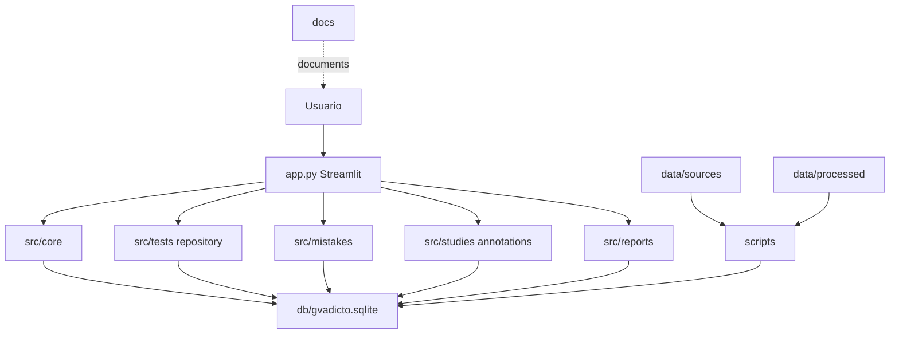
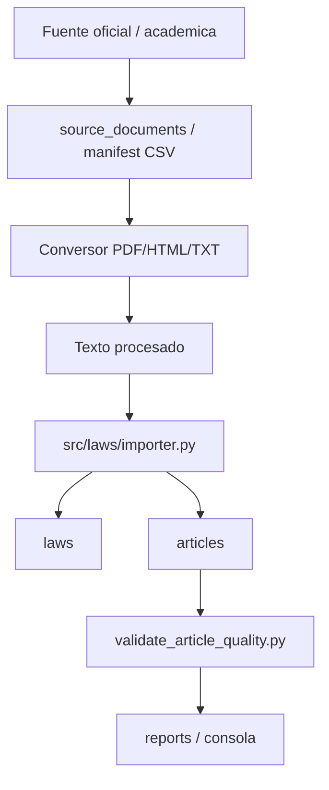
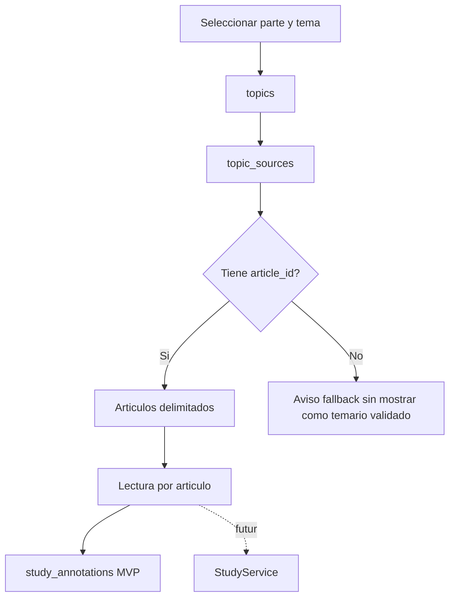
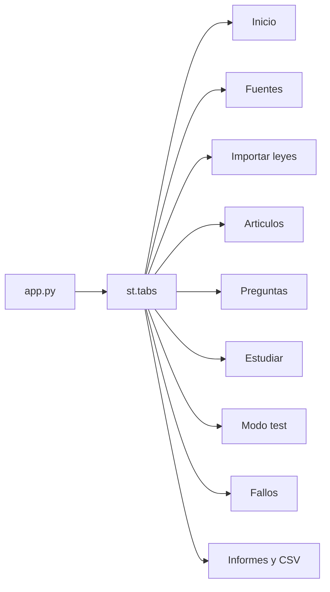
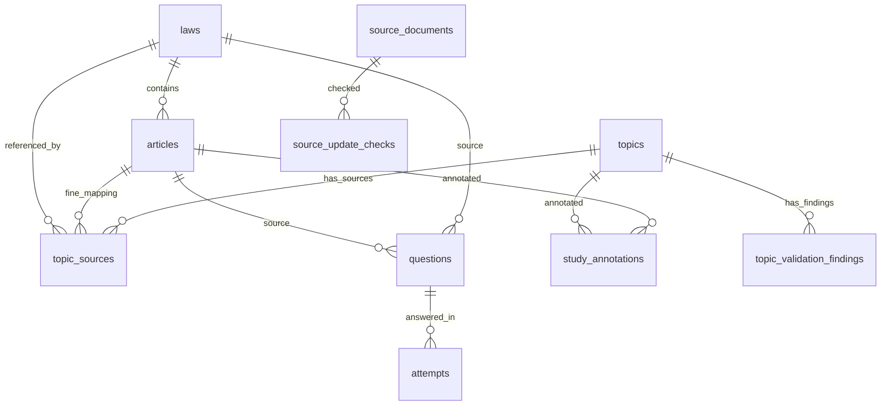
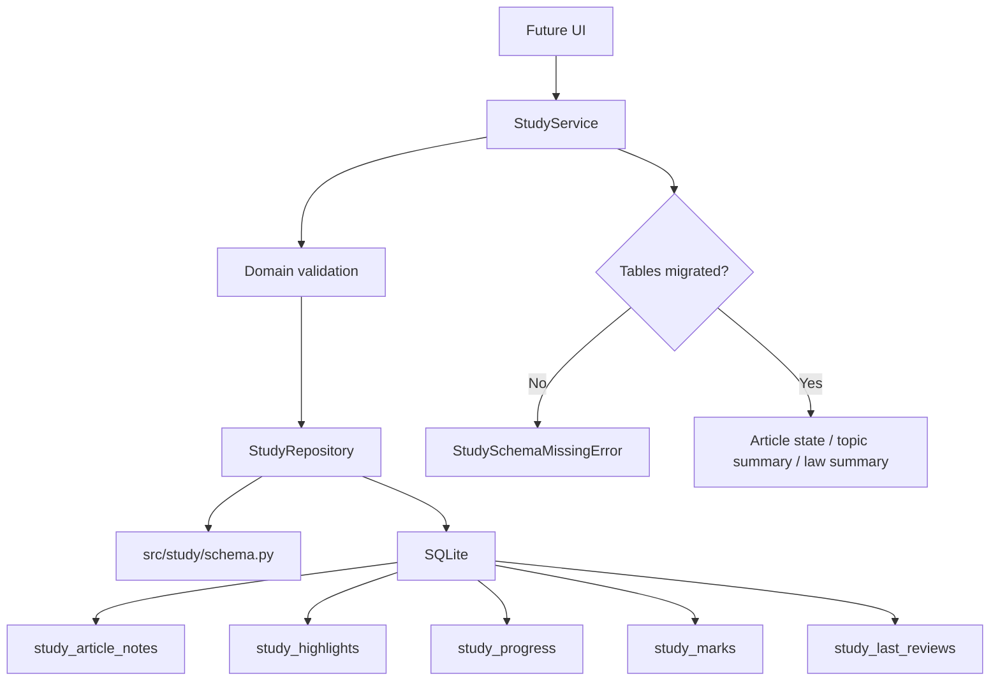

# Project Diagrams

## Arquitectura

```mermaid
flowchart TD
  User["Usuario"] --> Streamlit["app.py Streamlit"]
  Streamlit --> Core["src/core"]
  Streamlit --> Tests["src/tests repository"]
  Streamlit --> Mistakes["src/mistakes"]
  Streamlit --> StudiesLegacy["src/studies annotations"]
  Streamlit --> Reports["src/reports"]
  Core --> SQLite["db/gvadicto.sqlite"]
  Tests --> SQLite
  Mistakes --> SQLite
  StudiesLegacy --> SQLite
  Reports --> SQLite
  Scripts["scripts"] --> SQLite
  Sources["data/sources"] --> Scripts
  Processed["data/processed"] --> Scripts
  Docs["docs"] -.documents.-> User
```

## Flujo De Importacion

```mermaid
flowchart TD
  Source["Fuente oficial / academica"] --> Catalog["source_documents / manifest CSV"]
  Catalog --> Convert["Conversor PDF/HTML/TXT"]
  Convert --> Text["Texto procesado"]
  Text --> Importer["src/laws/importer.py"]
  Importer --> Laws["laws"]
  Importer --> Articles["articles"]
  Articles --> Quality["validate_article_quality.py"]
  Quality --> Reports["reports / consola"]
```

## Flujo De Estudio

```mermaid
flowchart TD
  TopicSelect["Seleccionar parte y tema"] --> Topic["topics"]
  Topic --> TopicSources["topic_sources"]
  TopicSources --> HasFine{"Tiene article_id?"}
  HasFine -->|Si| Articles["Articulos delimitados"]
  HasFine -->|No| Fallback["Aviso fallback sin mostrar como temario validado"]
  Articles --> Read["Lectura por articulo"]
  Read --> LegacyAnnotations["study_annotations MVP"]
  Read -.futuro.-> StudyService["StudyService"]
```

## Flujo UI

```mermaid
flowchart LR
  App["app.py"] --> Tabs["st.tabs"]
  Tabs --> Inicio["Inicio"]
  Tabs --> Fuentes["Fuentes"]
  Tabs --> Importar["Importar leyes"]
  Tabs --> Articulos["Articulos"]
  Tabs --> Preguntas["Preguntas"]
  Tabs --> Estudiar["Estudiar"]
  Tabs --> Test["Modo test"]
  Tabs --> Fallos["Fallos"]
  Tabs --> Informes["Informes y CSV"]
```

## Relaciones Entre Tablas

```mermaid
erDiagram
  laws ||--o{ articles : contains
  laws ||--o{ topic_sources : referenced_by
  articles ||--o{ topic_sources : fine_mapping
  topics ||--o{ topic_sources : has_sources
  articles ||--o{ questions : source
  laws ||--o{ questions : source
  questions ||--o{ attempts : answered_in
  topics ||--o{ study_annotations : annotated
  articles ||--o{ study_annotations : annotated
  source_documents ||--o{ source_update_checks : checked
  topics ||--o{ topic_validation_findings : has_findings
```

## Flujo StudyService

```mermaid
flowchart TD
  UI["Future UI"] --> Service["StudyService"]
  Service --> Validate["Domain validation"]
  Validate --> Repo["StudyRepository"]
  Repo --> Schema["src/study/schema.py"]
  Repo --> SQLite["SQLite"]
  SQLite --> Notes["study_article_notes"]
  SQLite --> Highlights["study_highlights"]
  SQLite --> Progress["study_progress"]
  SQLite --> Marks["study_marks"]
  SQLite --> Reviews["study_last_reviews"]
  Service --> Missing{"Tables migrated?"}
  Missing -->|No| Error["StudySchemaMissingError"]
  Missing -->|Yes| Result["Article state / topic summary / law summary"]
```

