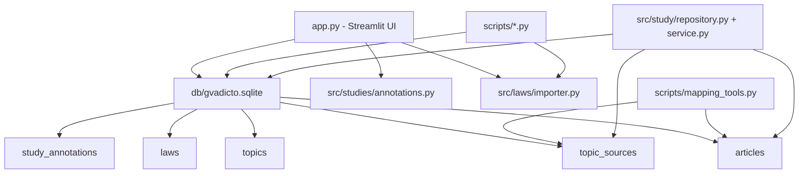
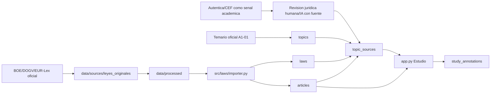

# System Stability Freeze - GVAdictos

Fecha de freeze: 2026-06-18

Este documento fija el estado tecnico estable del proyecto para que Claude Code u otro desarrollador pueda continuar sin redescubrir dependencias criticas ni romper la capa juridica. Es un documento operativo: define que se puede tocar, que requiere cautela y que no debe tocarse sin autorizacion explicita.

## 1. Resumen ejecutivo

GVAdictos es una aplicacion local-first en Streamlit para estudiar la oposicion A1-01 GVA. El nucleo actual combina:

- una base SQLite local como almacenamiento principal;
- normativa importada y troceada en articulos;
- relaciones tema -> norma -> articulo en `topic_sources`;
- una interfaz Streamlit monolitica en `app.py`;
- anotaciones MVP en `study_annotations`;
- un backend de estudio nuevo preparado en `src/study`, todavia no integrado en la UI principal.

La prioridad de estabilidad es preservar la coherencia entre `articles` y `topic_sources`. Cualquier cambio en articulos, parser, importer, normalizacion o mapping puede invalidar trabajo juridico ya hecho por Claude Code y dejar la UI mostrando contenido incorrecto.

## 2. Arquitectura estable actual



Componentes estables:

- `db/gvadicto.sqlite`: fuente operativa local. No debe modificarse en fases de documentacion o UI sin permiso.
- `articles`: articulado importado. Es la base del estudio por articulo.
- `topic_sources`: relacion juridica entre temas, normas y articulos. Es la base del mapping fino.
- `src/laws/importer.py`: parser/importador central. Sensible porque altera como se crean leyes y articulos.
- `scripts/validate_article_quality.py`: validacion read-only de calidad de articulos y referencias rotas.
- `scripts/report_mapping_status.py` y `scripts/mapping_tools.py`: diagnostico y tooling de mapping.
- `src/studies/annotations.py`: anotaciones MVP usadas por `app.py`.

Componentes preparados pero no plenamente integrados:

- `src/study/schema.py`
- `src/study/repository.py`
- `src/study/service.py`
- `scripts/migrate_study_features.py`
- `scripts/test_study_features.py`
- `scripts/report_study_features.py`

Estos forman el backend futuro de estudio, pero la UI principal sigue usando `study_annotations`.

## 3. Mapa de seguridad

### SAFE TO MODIFY

Estas zonas pueden modificarse con bajo riesgo si la tarea es documental, observabilidad, informes o preparacion no destructiva:

- `docs/*.md`
- `reports/*.md`
- `reports/*.json`
- scripts read-only de diagnostico, siempre que no escriban en BD:
  - `scripts/app_healthcheck.py`
  - `scripts/streamlit_diagnose.py`
  - `scripts/long_task_monitor.py`
  - `scripts/qa_session_report.py`
  - `scripts/report_mapping_status.py`
  - `scripts/validate_article_quality.py`
  - `scripts/audit_fallback_topics.py`
  - `scripts/audit_existing_fine_mappings.py`
  - `scripts/validate_mapping_review.py`
- tests que usen base temporal o dry-run:
  - `scripts/test_mapping_tools.py`
  - `scripts/test_study_features.py`
- documentacion de UI, branding, launcher, convenciones y handoff.

Regla: aunque una zona sea segura, no debe asumir cambios juridicos ni inventar contenido normativo.

### MODIFY WITH CAUTION

Estas zonas pueden tocarse solo con tarea concreta, cambios pequenos y verificacion:

- `app.py`
  - UI monolitica.
  - Depende de `topics`, `laws`, `articles`, `topic_sources` y `study_annotations`.
  - Cualquier cambio puede afectar importacion manual, busqueda de articulos, pestaña de estudio o anotaciones.
- `src/studies/annotations.py`
  - Backend legacy de anotaciones MVP usado por `app.py`.
  - No mezclar sin plan con `src/study`.
- `src/study/*`
  - Backend futuro de estudio.
  - Preparado, pero no debe aplicarse a BD real sin autorizacion.
- `src/core/db.py`
  - Define esquema base y migraciones ligeras por `init_db`.
  - Riesgo alto si se cambia el esquema de tablas juridicas.
- `src/core/source_catalog.py`
  - Puede afectar catalogo de fuentes y vigilancia normativa.
- `scripts/generate_controlled_questions.py`
  - Debe generar contenido juridico solo con fuente y marcar revision cuando proceda.
- `reports/mapping_review_template.csv`
  - Puede estar siendo usado por Claude Code para mappings. No editar sin coordinacion.
- `README.md`, `AGENTS.md`, `CLAUDE.md`
  - Documentacion principal. Tocar solo si mejora instrucciones actuales y no contradice el foco A1-01.

### DO NOT TOUCH

No modificar sin permiso explicito y sin checkpoint previo:

- `db/gvadicto.sqlite`
- `articles`
- `topic_sources`
- `src/laws/importer.py`
- parser de articulos en `src/laws/importer.py`
- scripts de normalizacion:
  - `scripts/normalize_articles_inplace.py`
  - `scripts/normalize_articles_pass2.py`
  - `scripts/normalize_articles_pass3.py`
  - `scripts/normalize_articles_pass4.py`
- scripts que aplican mappings:
  - `scripts/apply_mapping_review.py --apply`
  - `scripts/apply_a1_article_validation.py`
  - `scripts/apply_pilot_lpac_delimitation.py`
  - `scripts/apply_fase2b_lrjsp_lcsp_delimitation.py`
- scripts de reimportacion:
  - `scripts/import_law.py`
  - `scripts/import_official_sources.py`
  - `scripts/import_eurlex_direct.py`
  - `scripts/import_boe_pdf_laws.py`
  - `scripts/reimport_with_deduplication.py`
  - `scripts/import_source_manifest.py`
- originales oficiales:
  - `data/sources/leyes_originales/**`
- materiales academicos originales:
  - `Archivo Oposición TAG-GVA/**`
- backups SQLite:
  - `db/*.backup*.sqlite`

## 4. Punto de verdad del sistema

### Fuente de verdad de articulos

La fuente de verdad operativa de los articulos es la tabla `articles` en `db/gvadicto.sqlite`.

Los ficheros en `data/sources/leyes_originales/**` son procedencia oficial o material de origen. Los ficheros en `data/processed/**` son texto procesado. Ninguno sustituye a `articles` como fuente runtime para UI, mapping y tests.

Regla: si cambia `articles`, deben validarse como minimo:

```powershell
python scripts/validate_article_quality.py
python scripts/report_mapping_status.py
```

### Fuente de verdad del mapping tema -> norma -> articulo

La fuente de verdad del mapping fino es `topic_sources`.

Campos clave:

- `topic_id`: tema de oposicion.
- `law_id`: norma aplicable.
- `article_id`: articulo concreto delimitado. Si es `NULL`, no hay mapping fino.
- `normative_reference`: referencia textual de soporte.
- `mapping_basis`: origen/metodo del mapping.
- `validation_status`: estado de revision.
- `notes`: notas tecnicas o juridicas.

Regla: una relacion tema-norma sin `article_id` no equivale a "todo entra". Es fallback o relacion pendiente de delimitacion fina.

### Fuente de verdad de la UI de estudio

Fuente actual:

- `app.py`
- `topics`
- `topic_sources`
- `laws`
- `articles`
- `study_annotations`
- `src/studies/annotations.py`

Fuente futura prevista:

- `app.py` o una UI modular futura;
- `src/study/service.py`;
- `src/study/repository.py`;
- tablas nuevas de estudio:
  - `study_article_notes`
  - `study_highlights`
  - `study_progress`
  - `study_marks`
  - `study_last_reviews`

Hasta que haya migracion real autorizada, `StudyService` no debe considerarse fuente activa de la UI principal.

## 5. Dependencias criticas

### Scripts que dependen de `articles`

Read-only o diagnostico:

- `scripts/validate_article_quality.py`
- `scripts/report_mapping_status.py`
- `scripts/audit_existing_fine_mappings.py`
- `scripts/audit_fallback_topics.py`
- `scripts/mapping_tools.py`
- `scripts/test_mapping_tools.py`
- `scripts/generate_mapping_review_template.py`
- `scripts/generate_controlled_questions.py`
- `scripts/app_healthcheck.py`
- `scripts/report_study_features.py`
- `src/reports/basic.py`

Write/import/normalizacion sensibles:

- `scripts/import_law.py`
- `scripts/import_official_sources.py`
- `scripts/import_eurlex_direct.py`
- `scripts/import_boe_pdf_laws.py`
- `scripts/import_source_manifest.py`
- `scripts/reimport_with_deduplication.py`
- `scripts/normalize_articles_inplace.py`
- `scripts/normalize_articles_pass2.py`
- `scripts/normalize_articles_pass3.py`
- `scripts/normalize_articles_pass4.py`
- `scripts/apply_a1_article_validation.py`
- `scripts/apply_pilot_lpac_delimitation.py`
- `scripts/apply_fase2b_lrjsp_lcsp_delimitation.py`
- `scripts/apply_mapping_review.py`

### Scripts que dependen de `topic_sources`

Read-only o diagnostico:

- `scripts/report_mapping_status.py`
- `scripts/audit_fallback_topics.py`
- `scripts/audit_existing_fine_mappings.py`
- `scripts/validate_mapping_review.py`
- `scripts/mapping_tools.py`
- `scripts/app_healthcheck.py`
- `scripts/test_mapping_tools.py`
- `scripts/report_study_features.py`
- `scripts/validate_article_quality.py`

Write/mapping sensibles:

- `scripts/apply_mapping_review.py --apply`
- `scripts/apply_a1_article_validation.py`
- `scripts/apply_pilot_lpac_delimitation.py`
- `scripts/apply_fase2b_lrjsp_lcsp_delimitation.py`
- `scripts/import_topics_and_validate_coverage.py`
- scripts `normalize_articles_*` cuando repuntan o anulan `article_id`

### UI que depende de StudyService

Estado actual:

- `app.py` no depende todavia de `StudyService`.
- La UI actual usa `src/studies/annotations.py` y `study_annotations`.

Estado futuro:

- La integracion de `StudyService` debe hacerse como vertical slice pequena:
  1. ejecutar migracion real solo con permiso;
  2. conectar `StudyRepository`;
  3. leer estado de estudio por tema/articulo;
  4. crear/editar notas y highlights;
  5. mantener compatibilidad con `study_annotations` o migrar datos explicitamente.

### Procesos que dependen del parser/importer

Dependen directamente de `src/laws/importer.py`:

- subida/importacion manual en `app.py`;
- `scripts/import_law.py`;
- `scripts/import_official_sources.py`;
- `scripts/import_eurlex_direct.py`;
- `scripts/import_boe_pdf_laws.py`;
- `scripts/import_source_manifest.py`;
- `scripts/reimport_with_deduplication.py`;
- `scripts/apply_a1_article_validation.py` cuando asegura/importa Reglamento Les Corts;
- cualquier flujo futuro de vigilancia normativa que reimporte normas actualizadas.

Riesgo: cambiar el parser puede modificar ids, referencias, cuerpos o cortes de articulos. Eso afecta mappings, preguntas, anotaciones y la UI.

## 6. Flujo de datos definitivo



Notas:

- BOE/DOGV/EUR-Lex son fuente normativa oficial.
- Autentica y CEF ayudan a priorizar y comprobar cobertura, pero no sustituyen a la fuente oficial.
- `topic_sources.article_id IS NULL` significa mapping fino pendiente o fallback, no validacion articulo a articulo.
- Las preguntas deben generarse solo desde articulos validados y con fuente.

## 7. Riesgos de cambio futuro

### Si se modifica `articles`

Puede romper:

- `topic_sources.article_id`;
- `study_annotations.article_id`;
- tablas futuras de `src/study`;
- preguntas ya generadas con `article_id`;
- reportes de mapping;
- visualizacion de articulos por tema en `app.py`;
- validaciones de calidad.

Riesgo principal: perder correspondencia entre un articulo estudiado/anotado y el articulo real.

Mitigacion:

- backup previo de BD;
- hash antes/despues;
- dry-run si existe;
- ejecutar `validate_article_quality.py`;
- ejecutar `report_mapping_status.py`;
- revisar FKs rotas y duplicados.

### Si se modifica el parser

Puede cambiar:

- donde empieza/termina cada articulo;
- titulo y cuerpo;
- deteccion de disposiciones, anexos e indices;
- numero de articulos importados;
- estabilidad de reimportaciones.

Riesgo principal: el mapping validado deja de apuntar al texto correcto aunque el `article_id` siga existiendo.

Mitigacion:

- probar primero contra copia temporal;
- comparar conteos por norma;
- comparar referencias de articulos;
- no ejecutar en BD real mientras Claude Code este haciendo mappings.

### Si se modifica el importer

Puede cambiar:

- creacion o reutilizacion de `law_id`;
- borrado/recreacion de articulos;
- hash de originales;
- metadatos de fuente;
- comportamiento de reimportacion.

Riesgo principal: reemplazar datos estables y dejar desincronizados mappings, anotaciones y preguntas.

Mitigacion:

- usar backup;
- confirmar si el flujo borra articulos existentes;
- documentar normas afectadas;
- validar antes/despues con reports.

### Si se modifica `topic_sources`

Puede cambiar:

- que articulos aparecen en cada tema;
- si la UI muestra mapping fino o fallback;
- generacion de preguntas por tema;
- estado juridico de avance;
- informes de cobertura.

Riesgo principal: presentar al opositor articulos equivocados o marcar como validado algo pendiente.

Mitigacion:

- nunca editar manualmente sin reporte;
- usar `apply_mapping_review.py --dry-run` antes de cualquier apply;
- preservar `mapping_basis` y `validation_status`;
- no borrar mappings protegidos sin motivo documentado.

## 8. Reglas para futuros desarrolladores

1. No inventar contenido juridico.
2. Toda pregunta, explicacion o resumen juridico debe tener fuente oficial.
3. Todo contenido juridico generado por IA debe quedar marcado como pendiente de revision cuando corresponda.
4. No tratar materiales de academia como fuente normativa oficial.
5. No ejecutar scripts de importacion, normalizacion o apply mientras haya trabajo paralelo de mapping.
6. No modificar `articles` ni `topic_sources` en tareas de UI, branding, launcher o documentacion.
7. No integrar `StudyService` contra BD real sin migracion aprobada.
8. No cambiar parser/importer para arreglar un caso puntual sin pruebas de regresion.
9. No borrar documentos antiguos sin auditoria documental; marcarlos como obsoletos si procede.
10. Mantener cambios pequenos, verificables y con rollback claro.

## 9. Checklist antes de modificar cualquier cosa

Antes de tocar archivos:

- [ ] Clasificar la tarea: documentacion, UI, estudio, mapping, importacion, parser, datos.
- [ ] Confirmar si toca `db/gvadicto.sqlite`, `articles`, `topic_sources`, parser o importer.
- [ ] Si toca zona `DO NOT TOUCH`, pedir autorizacion explicita.
- [ ] Leer solo los documentos necesarios: `CLAUDE.md`, `docs/CLAUDE_KNOWLEDGE_DUMP.md`, este freeze y la doc especifica de la tarea.
- [ ] Comprobar estado git para no pisar cambios de Claude o del usuario.
- [ ] Si hay BD implicada, calcular hash previo.
- [ ] Si hay escritura en BD, crear backup previo.

Durante el cambio:

- [ ] Preferir dry-run.
- [ ] Mantener scope pequeno.
- [ ] No mezclar UI con mapping juridico.
- [ ] No mezclar StudyService con migracion real salvo permiso.
- [ ] No reimportar normas como efecto colateral.

Despues del cambio:

- [ ] Ejecutar validaciones especificas.
- [ ] Si hay articulos/mapping implicados:

```powershell
python scripts/validate_article_quality.py
python scripts/report_mapping_status.py
```

- [ ] Si hay UI:

```powershell
python -m compileall app.py src scripts
python scripts/app_healthcheck.py
```

- [ ] Comparar hash de BD si la tarea prometia no tocarla.
- [ ] Documentar archivos tocados, riesgos y siguiente paso.

## 10. Comandos seguros recomendados

Solo lectura o diagnostico:

```powershell
python -m compileall app.py src scripts
python scripts/app_healthcheck.py
python scripts/validate_article_quality.py
python scripts/report_mapping_status.py
python scripts/streamlit_diagnose.py
python scripts/long_task_monitor.py -- python scripts/report_mapping_status.py
```

Dry-run:

```powershell
python scripts/migrate_study_features.py --dry-run
python scripts/apply_mapping_review.py reports/mapping_review_template.csv --dry-run
```

Evitar salvo autorizacion explicita:

```powershell
python scripts/apply_mapping_review.py reports/mapping_review_template.csv --apply
python scripts/normalize_articles_inplace.py
python scripts/normalize_articles_pass2.py
python scripts/normalize_articles_pass3.py
python scripts/normalize_articles_pass4.py
python scripts/reimport_with_deduplication.py
python scripts/import_official_sources.py
python scripts/import_eurlex_direct.py
python scripts/import_boe_pdf_laws.py
```

## 11. Modulos criticos

Criticos por impacto juridico:

- `db/gvadicto.sqlite`
- `articles`
- `topic_sources`
- `src/laws/importer.py`
- `scripts/normalize_articles_*`
- `scripts/apply_*delimitation.py`
- `scripts/apply_mapping_review.py`

Criticos por impacto UI/estudio:

- `app.py`
- `src/studies/annotations.py`
- `study_annotations`
- `src/study/*`

Criticos por continuidad operativa:

- `scripts/app_healthcheck.py`
- `scripts/validate_article_quality.py`
- `scripts/report_mapping_status.py`
- `docs/CLAUDE_KNOWLEDGE_DUMP.md`
- `docs/CLAUDE_CODE_HANDOFF.md`
- `docs/DEVELOPMENT_CONVENTIONS.md`
- `docs/SYSTEM_STABILITY_FREEZE.md`

## 12. Estado recomendado para continuar

Orden seguro:

1. Claude Code continua la calidad de datos juridicos usando reports y dry-runs.
2. No se toca `articles` salvo tarea especifica de parser/importer con backup.
3. No se toca `topic_sources` salvo mapping explicito y validado.
4. La integracion UI debe esperar a que el mapping fino prioritario este suficientemente estable.
5. La integracion de StudyService debe hacerse con migracion autorizada y pruebas sobre copia o backup.
6. Branding, launcher y tipografia pueden avanzar desde documentacion y assets sin tocar datos.

Este freeze debe releerse antes de cualquier cambio que pueda afectar normativa, mapping o experiencia de estudio.
