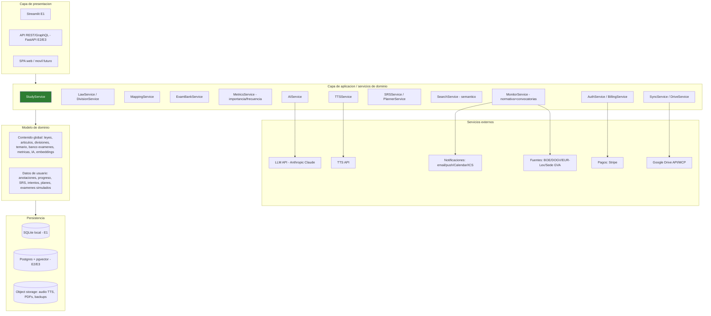
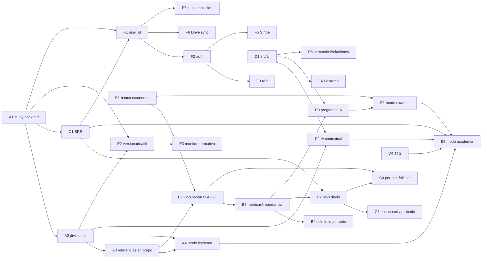

# GVAdictos — Visión de Producto y Arquitectura Futura (2026)

> Documento de arquitectura **solo de diseño**. No implementa nada. No modifica código, UI, BD,
> parser, importer, mappings, `articles`, `topic_sources` ni `StudyService`.
> Sirve como hoja de ruta para los próximos meses: cualquier desarrollo futuro debe seguir esta
> arquitectura para no rehacer trabajo ya hecho.

- **Autor:** Claude Code (Opus 4.8)
- **Fecha:** 2026-06-19
- **Estado:** propuesta de arquitectura (pendiente de aprobación humana por fases)
- **Documentos relacionados:** [PROJECT_ARCHITECTURE.md](PROJECT_ARCHITECTURE.md), [ROADMAP.md](ROADMAP.md), [STUDY_FEATURES_BACKEND.md](STUDY_FEATURES_BACKEND.md), [TECHNICAL_ROADMAP.md](TECHNICAL_ROADMAP.md), [CLAUDE.md](../CLAUDE.md)

---

## 0. Índice

1. Propósito y alcance
2. Visión de producto: de visor a plataforma SaaS
3. Principios de arquitectura
4. Estado actual (activos que NO se rehacen)
5. Arquitectura objetivo por capas
6. Diseño de datos por dominio
7. Catálogo de módulos de servicio (`src/`)
8. Servicios y APIs externas
9. Estrategia multiusuario y migración local-first → cloud
10. Orden de implementación (olas, dependencias, prioridad, complejidad, riesgo)
11. Matriz de dependencias entre funcionalidades
12. Riesgos transversales y mitigaciones
13. Decisiones de arquitectura (ADR resumidos)
14. Principios de no-regresión

---

## 1. Propósito y alcance

GVAdictos hoy es un **visor de legislación con delimitación tema→norma→artículo** y un MVP de
estudio. El objetivo de este documento es definir la arquitectura que permita evolucionar hacia
una **plataforma completa de preparación de oposiciones**, multiusuario y con un futuro modelo
**SaaS** (cuentas + suscripciones), sin romper lo construido.

Cubre: roadmap, arquitectura por capas, módulos, **diseño de datos**, dependencias, orden de
implementación, APIs externas (IA, TTS, notificaciones, monitorización, pagos) y riesgos.

**Fuera de alcance (deliberado):** implementación, código, migraciones reales, cambios de UI.
Todo el SQL de este documento es **ilustrativo** y describe el destino, no se aplica ahora.

---

## 2. Visión de producto: de visor a plataforma SaaS

Tres estadios de madurez. Cada uno es vendible/usable por sí mismo y no obliga a rehacer el anterior.

| Estadio | Descripción | Usuario | Despliegue |
|---|---|---|---|
| **E1 — Estudio personal (actual+)** | Visor + estudio por tema/ley, anotaciones, SRS, banco de exámenes, IA contextual, TTS | Único (local owner) | Local-first (Streamlit + SQLite) |
| **E2 — Plataforma multiusuario** | Todo lo anterior con cuentas, perfiles, sincronización, compartir apuntes | Multiusuario | Cloud (API + BD servidor) o local con `user_id` |
| **E3 — SaaS** | Suscripciones, entitlements, multi-oposición, panel de admin, monitores automáticos | Multiusuario + pago | Cloud gestionado |

**Tesis de arquitectura:** se llega a E3 **añadiendo columnas `user_id`, una capa de servicios
estable y una API**, no reescribiendo el dominio. Por eso desde ya todo diseño nuevo debe:
(a) separar contenido global (leyes, artículos, temario, banco de exámenes, métricas) de datos
de usuario (anotaciones, progreso, SRS, intentos); (b) pasar por la capa de servicios, nunca SQL
directo desde la UI; (c) ser agnóstico de motor de BD (SQLite hoy, Postgres mañana).

---

## 3. Principios de arquitectura

1. **Local-first, cloud-ready.** SQLite sigue siendo válido para E1. El esquema y la capa de
   servicios se diseñan para migrar a Postgres sin reescribir dominio (SQL estándar, sin features
   exclusivas de SQLite en lógica de negocio).
2. **Separación contenido global ↔ datos de usuario.** Es la condición que hace barato el salto a
   multiusuario. Ver §6 y §9.
3. **Capa de servicios obligatoria.** La UI (Streamlit hoy, API/SPA mañana) nunca toca SQL. Toda
   regla de dominio vive en `src/<dominio>/service.py`. Esto ya está iniciado en `src/study/`.
4. **Rigor jurídico no negociable (CLAUDE.md).** Nada inventado. Toda afirmación jurídica con
   fuente. Contenido oficial (BOE/DOGV/EUR-Lex) ≠ material académico (CEF/Autentica). Todo
   contenido generado por IA nace `requiere_revision=1` / `pendiente_de_validacion`.
5. **Trazabilidad y reversibilidad.** Todo dato derivado lleva `mapping_basis`/`source`/`model`+
   `prompt_version`. Toda escritura masiva: backup + dry-run + validación (patrón ya consolidado
   en `scripts/apply_fase2*`).
6. **Modularidad por dominio y por oposición.** Añadir una oposición = cargar datos, no tocar
   arquitectura (§6.13). Cada funcionalidad grande = un paquete en `src/` con servicio propio.
7. **Idempotencia y versionado de derivados.** IA, TTS, embeddings y métricas se recalculan; se
   cachean por `content_hash` y se invalidan cuando cambia el texto base.
8. **Contenido versionado, anotaciones ancladas.** Las anotaciones se anclan a un `anchor_key`
   estable (ya presente en `src/study/schema.py`) para sobrevivir reimportaciones y cambios de
   versión legislativa.

---

## 4. Estado actual (activos que NO se rehacen)

Inventario real (2026-06-19) sobre `db/gvadicto.sqlite`, para anclar el diseño y evitar rework.

### 4.1 Tablas existentes (contenido global)

| Tabla | Filas | Rol | Reutilización futura |
|---|---:|---|---|
| `laws` | 81 | Norma importada | Base de versionado legislativo (§6.2) |
| `articles` | 6.792 | Artículo/bloque normativo | Núcleo; se le **añade estructura jerárquica** vía tablas laterales (§6.1) sin tocarla |
| `topics` | 75 | Temario oficial A1-01 | Base de multi-oposición (§6.13) |
| `topic_sources` | 3.814 | Mapping tema→norma→artículo (62/75 finos) | Capa materializada; el authoring pasa a "segmentos en grupo" (§6.1) |
| `questions` | 20 | Preguntas tipo test | Convive con preguntas IA y banco oficial |
| `attempts` | 0 | Intentos del usuario | Pasa a llevar `user_id` (§9) |
| `source_documents` | 157 | Catálogo de fuentes (oficial + Drive/CEF) | Base de recursos, versiones y backup Drive |
| `source_update_checks` | 206 | Histórico de vigilancia normativa | Base del monitor normativo (§6.10) |
| `study_annotations` | 0 | Anotaciones MVP | Sustituida por `src/study` (notas/highlights) |
| `topic_study_resources` | 10 | Enlace tema→material académico (CEF) | Patrón de recursos por tema (§6.14) |
| `topic_validation_findings` | 32 | Hallazgos de validación jurídica | Base de cola de revisión humana |

### 4.2 Backend de estudio ya diseñado (`src/study/schema.py`, aún no migrado a BD real)

Tablas propuestas con **patrón de snapshot/anclaje** (clave para versionado): `study_article_notes`,
`study_highlights`, `study_progress`, `study_marks`, `study_last_reviews`. Esta última ya tiene
`next_review_at`, `last_result (again/hard/good/easy)`, `confidence`, `review_count` → **base directa
de SRS** (§6.7). Columnas `law_id_snapshot`, `article_ref_snapshot`, `anchor_key` → **base directa de
conservación de subrayado entre versiones** (§6.2).

### 4.3 Paquetes `src/` (placeholders ya creados → destino de cada dominio)

`src/core` (db, paths, export, source_catalog), `src/laws` (importer — **zona sensible**), `src/tests`,
`src/mistakes`, `src/reports`, `src/studies` (MVP), `src/study` (backend nuevo), y placeholders
`src/anki`, `src/planner`, `src/notifications`, `src/simulacros`, `src/watchers`. **Cada placeholder
es el hogar previsto de un dominio de este documento.**

### 4.4 Conclusión de estado

La base es sólida: contenido jurídico normalizado, 62/75 temas con delimitación fina, catálogo de
fuentes, vigilancia normativa y un backend de estudio diseñado con los anclajes correctos. **El salto
a plataforma es sobre todo aditivo.**

---

## 5. Arquitectura objetivo por capas



**Reglas de capa:**

- **Presentación** solo llama a servicios. Hoy Streamlit; mañana una API que reutiliza los mismos
  servicios. No duplicar lógica.
- **Servicios** encapsulan dominio, validación y rigor jurídico. Único punto que escribe en BD.
- **Persistencia** abstraída por un repositorio (`repository.py` por dominio, ya iniciado). SQL
  estándar; el motor (SQLite/Postgres) es un detalle de configuración.
- **Externos** detrás de adaptadores (puertos/adaptadores) para poder cambiar de proveedor de IA,
  TTS o pagos sin tocar el dominio.

---

## 6. Diseño de datos por dominio

> Todo SQL es **ilustrativo del destino**. No aplicar ahora. Las tablas nuevas son aditivas y no
> rompen el esquema actual. Las columnas `user_id` se introducen en la ola multiusuario (§9); hasta
> entonces se asume `user_id = 1` (owner local) por defecto.

### 6.1 Estructura legislativa jerárquica y referencias "en grupo"

**Problema.** Hoy `articles.chapter`/`section` existen pero están vacías, y `topic_sources` mapea
**artículo por artículo** (3.814 filas). El requisito es: reflejar la estructura interna de la ley
(libro/título/capítulo/sección/subsección) y, cuando entra un capítulo entero o varios artículos
seguidos, **referenciarlos en grupo** ("arts. 25-31, Capítulo III") como hace la legislación, no fila
a fila. Para artículos sueltos, indicar a qué división pertenecen.

**Diseño (aditivo, no toca `articles` ni `topic_sources`):**

```sql
-- Árbol de divisiones por ley (libro > título > capítulo > sección > subsección)
CREATE TABLE law_divisions (
    id INTEGER PRIMARY KEY,
    law_id INTEGER NOT NULL REFERENCES laws(id),
    parent_id INTEGER REFERENCES law_divisions(id),
    division_type TEXT NOT NULL,      -- libro|titulo|capitulo|seccion|subseccion|disposicion
    number TEXT,                      -- "III", "1", "PRELIMINAR"
    label TEXT,                       -- "De la potestad sancionadora"
    order_index INTEGER NOT NULL,     -- orden dentro del padre
    full_path TEXT                    -- "Título Preliminar > Capítulo III"
);

-- Pertenencia artículo → división hoja (sin modificar articles)
CREATE TABLE article_division (
    article_id INTEGER NOT NULL REFERENCES articles(id),
    division_id INTEGER NOT NULL REFERENCES law_divisions(id),
    is_primary INTEGER NOT NULL DEFAULT 1,
    PRIMARY KEY (article_id, division_id)
);

-- Authoring de mapping "en grupo": un tema puede cubrir una división entera,
-- un rango contiguo de artículos, o un artículo suelto.
CREATE TABLE topic_source_segments (
    id INTEGER PRIMARY KEY,
    topic_id INTEGER NOT NULL REFERENCES topics(id),
    law_id INTEGER NOT NULL REFERENCES laws(id),
    segment_type TEXT NOT NULL,       -- division | range | single
    division_id INTEGER REFERENCES law_divisions(id),
    from_article_id INTEGER REFERENCES articles(id),
    to_article_id INTEGER REFERENCES articles(id),
    priority TEXT NOT NULL,
    mapping_basis TEXT NOT NULL,
    validation_status TEXT NOT NULL,
    notes TEXT
);
```

**Relación con lo existente (clave para no rehacer):** `topic_source_segments` es la **capa de
autoría** (cómo lo escribe/lee un humano: "Capítulo III completo"). El actual `topic_sources` (fila
por artículo) pasa a ser la **capa materializada** que se *deriva* expandiendo los segmentos — y que
ya consumen las analíticas y el modo Estudio. Así, la UI puede mostrar "arts. 25-31 (Cap. III)" en
grupo mientras las estadísticas por artículo siguen funcionando sin cambios. La materialización es un
job idempotente (segmento → filas `topic_sources`).

**Origen de los datos de divisiones:** el parser/importer ya ve cabeceras "TÍTULO/CAPÍTULO/SECCIÓN"
(de hecho hoy se filtran). Un extractor de estructura (nuevo, fuera del importer sensible) las lee de
`articles.text` y de la fuente para poblar `law_divisions` + `article_division`. Trabajo de datos,
no de esquema.

**Dependencias:** habilita referencias en grupo (UI), modo estudio por ley (§6.12), búsqueda por
estructura, y mejora la legibilidad del mapping.

### 6.2 Versionado legislativo, historial y comparación entre versiones

**Requisitos cubiertos:** historial legislativo, diff entre versiones, resaltado de cambios,
**conservación del subrayado entre versiones**, y base del monitor normativo.

```sql
CREATE TABLE law_versions (
    id INTEGER PRIMARY KEY,
    law_id INTEGER NOT NULL REFERENCES laws(id),
    version_label TEXT NOT NULL,        -- "consolidado 2025-03-15"
    vigencia_desde TEXT, vigencia_hasta TEXT,
    source_document_id INTEGER REFERENCES source_documents(id),
    content_hash TEXT NOT NULL,
    imported_at TEXT NOT NULL,
    is_current INTEGER NOT NULL DEFAULT 1
);

CREATE TABLE article_versions (
    id INTEGER PRIMARY KEY,
    law_version_id INTEGER NOT NULL REFERENCES law_versions(id),
    article_ref TEXT NOT NULL,
    anchor_key TEXT NOT NULL,           -- estable entre versiones (mismo que study_*)
    text TEXT NOT NULL,
    text_hash TEXT NOT NULL,
    change_type TEXT,                   -- added|modified|repealed|unchanged
    diff_summary TEXT
);
```

**Conservación del subrayado:** `study_highlights`/`study_article_notes` ya guardan
`anchor_key` + `article_ref_snapshot` + `selected_text`. Al entrar una versión nueva, un
**remapeo de anclajes** (servicio) reasocia las anotaciones del `anchor_key` antiguo al
`article_versions` nuevo; si el `selected_text` ya no aparece literal, se marca "revisar
anotación" en lugar de perderla. Esto ya está previsto en el diseño de `src/study`.

**Motor de diff:** compara `article_versions.text` entre dos `law_versions` → produce informe de
cambios y, cruzando con `topic_sources`, indica **qué temas y artículos quedan afectados**.

### 6.3 Banco de exámenes oficiales (Pregunta → Artículo → Ley → Tema)

Adopta y amplía la propuesta de [ROADMAP.md §5.1](ROADMAP.md). Reutiliza el patrón de `topic_sources`
(FK a `articles.id`, `mapping_basis`, `pendiente_de_validacion`).

```sql
CREATE TABLE exam_papers (
    id INTEGER PRIMARY KEY, oposicion_id INTEGER, convocatoria TEXT, anio INTEGER,
    bloque TEXT, fase TEXT, fuente_oficial_url TEXT, fuente_path TEXT,
    answer_key_version TEXT, estado TEXT, validation_status TEXT, notes TEXT
);
CREATE TABLE exam_questions (
    id INTEGER PRIMARY KEY, exam_paper_id INTEGER NOT NULL REFERENCES exam_papers(id),
    numero INTEGER, enunciado TEXT NOT NULL, es_reserva INTEGER DEFAULT 0,
    respuesta_oficial TEXT, anulada INTEGER DEFAULT 0, motivo_anulacion TEXT,
    validation_status TEXT NOT NULL
);
CREATE TABLE exam_question_options (
    id INTEGER PRIMARY KEY, exam_question_id INTEGER NOT NULL REFERENCES exam_questions(id),
    letra TEXT, texto TEXT, es_correcta INTEGER
);
CREATE TABLE exam_question_links (   -- la vinculación Pregunta→Artículo→Ley→Tema
    id INTEGER PRIMARY KEY, exam_question_id INTEGER NOT NULL REFERENCES exam_questions(id),
    topic_id INTEGER, law_id INTEGER, article_id INTEGER,
    tipo_relacion TEXT, mapping_basis TEXT, confianza REAL, validation_status TEXT NOT NULL
);
```

**Regla jurídica:** la vinculación pregunta→artículo es trabajo jurídico con el mismo rigor que la
delimitación fina. No inferir el artículo si la pregunta no lo cita de forma inequívoca; dejar
`pendiente_de_validacion` y registrar `confianza`. Anuladas y reservas se conservan (afectan a la
analítica). Empezar por 1-2 convocatorias piloto.

### 6.4 Estadísticas de frecuencia e importancia objetiva

**Requisitos:** artículos/leyes/temas más preguntados, contador "veces preguntado" sobre la propia
entidad, ranking, última aparición, dificultad histórica, importancia objetiva, "Solo lo importante",
ranking global de dificultad.

Diseño: tablas de **métricas materializadas** recalculadas por un job (no se calcula en caliente).

```sql
CREATE TABLE article_metrics (
    article_id INTEGER PRIMARY KEY REFERENCES articles(id),
    exam_count INTEGER, last_exam_year INTEGER,
    difficulty_index REAL,        -- % fallo histórico (exámenes + usuarios)
    modification_count INTEGER,   -- nº de cambios legislativos (de article_versions)
    user_error_rate REAL,         -- agregado de attempts (global o por usuario)
    repetition_count INTEGER,
    importance_score REAL,        -- fórmula §6.4.1
    computed_at TEXT NOT NULL
);
-- análogas: law_metrics(law_id, ...), topic_metrics(topic_id, ...)
```

**6.4.1 Fórmula de importancia objetiva (configurable, versionada).**
`importance = w1·norm(exam_count) + w2·recencia(last_exam_year) + w3·difficulty_index +
w4·norm(modification_count) + w5·user_error_rate + w6·peso_tema`. Los pesos `w*` se guardan
versionados (`importance_weights(version, w1..wn, active)`) para poder re-explicar por qué un
artículo es "importante". "Solo lo importante" = filtro por `importance_score ≥ umbral`. Rankings =
`ORDER BY` sobre las tablas de métricas. El contador "preguntado N veces" se lee de `article_metrics`.

**Dependencia dura:** requiere banco de exámenes (§6.3) con masa crítica y delimitación fina
(≥30-40 temas, ya cumplido: 62/75).

### 6.5 IA contextual sobre cada artículo

**Requisitos:** explicación sencilla, resumen, mnemotecnia, comparación con otros artículos, errores
habituales, "qué suele preguntarse".

```sql
CREATE TABLE ai_article_insights (
    id INTEGER PRIMARY KEY,
    article_id INTEGER NOT NULL REFERENCES articles(id),
    article_version_id INTEGER REFERENCES article_versions(id),  -- a qué texto aplica
    insight_type TEXT NOT NULL,   -- explicacion|resumen|mnemotecnia|comparacion|errores|que_se_pregunta
    content TEXT NOT NULL,
    model TEXT NOT NULL, prompt_version TEXT NOT NULL,
    input_hash TEXT NOT NULL,     -- caché: si el artículo no cambió, no se regenera
    requiere_revision INTEGER NOT NULL DEFAULT 1,
    validation_status TEXT NOT NULL DEFAULT 'pendiente_de_validacion',
    generated_at TEXT NOT NULL
);
```

**Reglas:** todo insight nace `requiere_revision=1`. La comparación "con otros artículos" se apoya en
`article_relations` (§6.9) y en `exam_question_links`. "Qué suele preguntarse" se nutre del banco de
exámenes (§6.3) + métricas (§6.4): IA + datos, no IA sola. Caché por `input_hash` (texto del artículo
+ prompt_version + model); se invalida al cambiar la versión legislativa.

### 6.6 Generación de preguntas por IA

**Tipos:** normales, difíciles, estilo oficial, trampa, con explicación razonada. Reutiliza el
modelo de `questions` añadiendo procedencia, o tabla paralela `ai_questions` con FK a artículo.

```sql
CREATE TABLE ai_questions (
    id INTEGER PRIMARY KEY,
    article_id INTEGER REFERENCES articles(id), topic_id INTEGER REFERENCES topics(id),
    estilo TEXT,                  -- normal|dificil|oficial|trampa
    enunciado TEXT, opcion_a TEXT, opcion_b TEXT, opcion_c TEXT, opcion_d TEXT,
    respuesta_correcta TEXT, explicacion_razonada TEXT,
    model TEXT, prompt_version TEXT,
    requiere_revision INTEGER NOT NULL DEFAULT 1,
    validation_status TEXT NOT NULL DEFAULT 'pendiente_de_validacion',
    created_at TEXT NOT NULL
);
```

**Regla CLAUDE.md:** preguntas IA siempre `requiere_revision=1` y con fuente (artículo). Las de
"estilo oficial" se calibran contra el banco real (§6.3) pero **no** se presentan como oficiales.

### 6.7 SRS (repetición espaciada tipo Anki) y plan diario

**Base existente:** `study_last_reviews` ya tiene `next_review_at`, `last_result`, `confidence`,
`review_count`. Se amplía a un estado SRS completo (SM-2 hoy, FSRS opcional después).

```sql
CREATE TABLE srs_state (
    id INTEGER PRIMARY KEY, user_id INTEGER NOT NULL,
    scope_type TEXT NOT NULL,     -- article | question | topic
    scope_id INTEGER NOT NULL,
    algo TEXT NOT NULL DEFAULT 'sm2',
    ease REAL, interval_days REAL, due_at TEXT,
    reps INTEGER, lapses INTEGER, state TEXT,  -- new|learning|review|relearning
    updated_at TEXT NOT NULL,
    UNIQUE(user_id, scope_type, scope_id)
);
CREATE TABLE study_plan_days (
    id INTEGER PRIMARY KEY, user_id INTEGER NOT NULL, plan_date TEXT NOT NULL,
    generated_at TEXT NOT NULL, target_minutes INTEGER
);
CREATE TABLE study_plan_items (
    id INTEGER PRIMARY KEY, plan_day_id INTEGER NOT NULL REFERENCES study_plan_days(id),
    scope_type TEXT, scope_id INTEGER,
    reason TEXT,                   -- vencimiento_srs|error|frecuencia|importancia|olvido
    estimated_minutes INTEGER, status TEXT  -- pending|done|skipped
);
```

**Planner / objetivos diarios:** servicio que combina (a) tarjetas SRS vencidas, (b) artículos con
alto `user_error_rate` (de `attempts`), (c) alta `importance_score` (§6.4), (d) olvidos detectados.
Genera el plan del día y los objetivos. Reajuste por días perdidos (Fase 3 del ROADMAP).

### 6.8 Texto a voz (TTS)

**Requisitos:** audio por artículo, bloque, tema y ley completa; velocidad configurable.

```sql
CREATE TABLE tts_audio (
    id INTEGER PRIMARY KEY,
    scope_type TEXT NOT NULL,     -- article|division|topic|law
    scope_id INTEGER NOT NULL,
    voice TEXT, speed REAL DEFAULT 1.0, fmt TEXT DEFAULT 'mp3',
    content_hash TEXT NOT NULL,   -- del texto fuente; invalida caché si cambia
    storage_url TEXT,             -- object storage / Drive
    duration_s REAL, generated_at TEXT NOT NULL
);
```

**Arquitectura:** `TTSService` con adaptador de proveedor. MVP barato = `SpeechSynthesis` del
navegador (velocidad configurable, sin coste, sin caché persistente). Calidad alta = API cloud
(Google/Azure/ElevenLabs) con caché de ficheros en object storage/Drive. La "ley completa" se
construye concatenando audios por división (§6.1).

### 6.9 Búsqueda semántica y mapa de relaciones

```sql
CREATE TABLE article_embeddings (
    article_id INTEGER PRIMARY KEY REFERENCES articles(id),
    model TEXT NOT NULL, dim INTEGER NOT NULL,
    vector BLOB NOT NULL,         -- sqlite-vec (E1) / pgvector (E2/E3)
    input_hash TEXT NOT NULL, computed_at TEXT NOT NULL
);
CREATE TABLE article_relations (
    id INTEGER PRIMARY KEY,
    from_article_id INTEGER NOT NULL, to_article_id INTEGER NOT NULL,
    relation_type TEXT NOT NULL,  -- cita|desarrolla|concordancia|similar_semantica
    weight REAL, source TEXT       -- extracted|ai|manual|embedding
);
```

**Buscador semántico** (por conceptos jurídicos): `SearchService` con embeddings + reranking;
SQLite-vec en local, pgvector en cloud. **Mapa de relaciones:** grafo a partir de `article_relations`
(citas extraídas del texto + similitud semántica + curado manual/IA). Alimenta "comparación con otros
artículos" (§6.5) y la navegación.

### 6.10 Monitor de normativa y de convocatorias

**Base existente:** `source_documents` + `source_update_checks` + `scripts/check_source_updates.py` +
`src/watchers/`. Se amplía con detección de cambios a nivel de artículo y de convocatoria.

```sql
CREATE TABLE legislative_changes (
    id INTEGER PRIMARY KEY, law_id INTEGER, article_ref TEXT,
    from_version_id INTEGER, to_version_id INTEGER,
    change_type TEXT, affected_topics TEXT, detected_at TEXT, notified INTEGER DEFAULT 0
);
CREATE TABLE convocatoria_snapshots (   -- ROADMAP §5.2
    id INTEGER PRIMARY KEY, oposicion_id INTEGER, convocatoria TEXT,
    fuente TEXT, fetched_at TEXT, content_hash TEXT, path TEXT
);
CREATE TABLE convocatoria_events (
    id INTEGER PRIMARY KEY, oposicion_id INTEGER, event_type TEXT, -- bases|listas|tribunal|fecha|sede|resultados|correccion
    titulo TEXT, published_at TEXT, source_url TEXT, payload TEXT, notified INTEGER DEFAULT 0
);
```

**Monitor normativo:** fetch (watchers) → normaliza → hash → si cambia, crea `law_versions` nueva +
`legislative_changes` + informe de impacto (qué artículos/temas cambian) → permite al usuario comparar
versiones (§6.2). **Monitor de convocatorias:** vigila DOGV/sede GVA/BOE; detecta convocatoria, bases,
listas, tribunal, fechas, aula, sede, resultados; emite `convocatoria_events` + avisos (§8). Fuente
oficial obligatoria para decisiones de vigencia (no academia).

### 6.11 Modo examen (simulacro de convocatoria) y modo Academia

```sql
CREATE TABLE mock_exams (
    id INTEGER PRIMARY KEY, user_id INTEGER NOT NULL, oposicion_id INTEGER,
    config TEXT,                  -- nº preguntas, tiempo, bloques, fuente (oficial/IA/mixto)
    started_at TEXT, finished_at TEXT, score REAL, passed INTEGER
);
CREATE TABLE mock_exam_answers (
    id INTEGER PRIMARY KEY, mock_exam_id INTEGER NOT NULL REFERENCES mock_exams(id),
    question_ref TEXT, source_kind TEXT,  -- exam_question | ai_question | question
    respuesta_usuario TEXT, correcta INTEGER, tiempo_s REAL
);
```

**Modo examen:** replica formato real (nº preguntas, tiempo, reserva, penalización por error si
aplica) usando banco oficial (§6.3) y/o preguntas IA (§6.6). Estadísticas detalladas por bloque/tema/
artículo. **Modo Academia:** flujo guiado por tema (artículos → IA → notas → audio → preguntas
oficiales → preguntas IA → repasos SRS → resumen); es un **orquestador** sobre los servicios de §6.3,
§6.5–6.8, no nuevas tablas (salvo `study_flow_state` opcional para recordar el punto del flujo).

### 6.12 Modos de estudio (por ley, por tema, "Solo lo importante")

- **Por ley:** recorrer una ley del primer al último artículo usando `law_divisions` (§6.1) para la
  estructura, e indicando en cada artículo **a qué tema** pertenece (lectura inversa de `topic_sources`/
  segmentos). No requiere tablas nuevas.
- **Por tema (Academia):** §6.11.
- **Solo lo importante:** filtro por `importance_score` (§6.4).

### 6.13 Multi-oposición (modularidad sin tocar arquitectura)

**Requisito:** añadir oposiciones cargando temario+normativa, sin cambiar el esquema.

```sql
CREATE TABLE oposiciones (
    id INTEGER PRIMARY KEY, code TEXT UNIQUE,   -- "A1-01-GVA"
    nombre TEXT, administracion TEXT, activa INTEGER DEFAULT 1
);
-- topics gana oposicion_id (las leyes/articulos son COMPARTIDOS entre oposiciones)
```

`laws`/`articles` son **contenido compartido** (una misma ley sirve a varias oposiciones). El temario
(`topics`) y su mapping pertenecen a una oposición. Añadir una oposición = insertar `oposiciones` +
sus `topics` + mapear a leyes existentes/nuevas. El banco de exámenes, métricas y datos de usuario se
filtran por `oposicion_id`. Cero cambios de arquitectura, solo datos.

### 6.14 Anotaciones, subrayado, notas, marcadores, etiquetas (multiusuario)

Base: `src/study` (`study_article_notes`, `study_highlights`, `study_marks`) + `topic_study_resources`
(material académico). En la ola multiusuario todas ganan `user_id`. El anclaje por `anchor_key` (§6.2)
garantiza persistencia entre versiones. Etiquetas: campo `tags` (ya presente) o tabla `tags` +
`taggable` si se quiere taxonomía compartida.

### 6.15 Lectura optimizada (UX/tipografía/contraste)

Mayormente capa de presentación + una tabla de preferencias:

```sql
CREATE TABLE user_reading_preferences (
    user_id INTEGER PRIMARY KEY,
    font_family TEXT, font_size INTEGER, line_height REAL, max_width INTEGER,
    theme TEXT,                   -- light|dark|sepia
    contrast TEXT, dyslexia_mode INTEGER DEFAULT 0
);
```

Defaults basados en evidencia de legibilidad (medida de línea 60-75 car., interlineado 1.5,
contraste AA/AAA, tipografías para lectura prolongada). Se documenta en un *design system* (tokens de
color/tipografía) reutilizable por Streamlit y futura SPA. Ver [BRANDING_GUIDE.md](BRANDING_GUIDE.md).

### 6.16 Por qué fallaste y qué repasar

Cruce de `attempts`/`mock_exam_answers` con `exam_question_links`/`ai_questions` → identifica el
artículo/tema del fallo, registra `causa_error` (ya existe en `attempts`), y propone repaso (inyecta
ítems en `study_plan_items` con `reason='error'`). Conecta SRS (§6.7) + métricas (§6.4).

---

## 7. Catálogo de módulos de servicio (`src/`)

Cada dominio = un paquete con `repository.py` (datos) + `service.py` (dominio). Mapeo a paquetes ya
existentes para no crear estructura nueva innecesaria:

| Paquete | Estado | Responsabilidad futura |
|---|---|---|
| `src/core` | activo | db/paths/export/source_catalog; añadir capa de repositorio común y config de motor (SQLite/PG) |
| `src/laws` | activo (sensible) | importer (no tocar sin backup); **nuevo** `divisions.py` (extractor de estructura §6.1) fuera del parser sensible |
| `src/study` | diseñado | notas, highlights, progreso, marcas, SRS (§6.7), anclaje/remapeo (§6.2) |
| `src/tests` | activo | preguntas (manuales, IA §6.6, banco oficial §6.3 → submódulo `exambank`) |
| `src/mistakes` | activo | intentos, "por qué fallaste" (§6.16) |
| `src/planner` | placeholder | plan diario, objetivos, reajuste (§6.7) |
| `src/simulacros` | placeholder | modo examen (§6.11) |
| `src/watchers` | placeholder | monitores normativa + convocatorias (§6.10) |
| `src/notifications` | placeholder | email/push/Calendar/ICS (§8) |
| `src/reports` | activo | dashboards, métricas, "Camino hacia el aprobado" (§6.4) |
| `src/anki` | placeholder | export/import Anki, interop SRS |
| **`src/ai`** (nuevo) | — | AIService: insights (§6.5), generación de preguntas (§6.6), adaptador LLM |
| **`src/audio`** (nuevo) | — | TTSService (§6.8) |
| **`src/search`** (nuevo) | — | embeddings, búsqueda semántica, relaciones (§6.9) |
| **`src/metrics`** (nuevo) | — | importancia/frecuencia/dificultad (§6.4) |
| **`src/accounts`** (nuevo) | — | auth, perfiles, suscripciones, entitlements (§9) |
| **`src/sync`** (nuevo) | — | Drive backup/sync, compartir recursos (§8/§9) |

---

## 8. Servicios y APIs externas

| Dominio | Servicio externo (opciones) | Adaptador | Notas / coste / riesgo |
|---|---|---|---|
| IA (insights, preguntas, explicaciones) | **Anthropic Claude** (modelos vigentes; por defecto el más capaz) | `src/ai` puerto LLM | Coste por token; caché por `input_hash`; todo output `requiere_revision` |
| TTS | Browser SpeechSynthesis (MVP) / Google / Azure / ElevenLabs | `src/audio` | MVP gratis sin caché; cloud con caché en Drive/objeto |
| Embeddings/semántica | Modelo de embeddings (proveedor IA) + sqlite-vec / pgvector | `src/search` | Local viable en E1; pgvector en cloud |
| Notificaciones | Email (SMTP/SendGrid), push web, Google Calendar/Tasks, ICS | `src/notifications` | Para objetivos diarios, convocatorias, repasos |
| Monitorización fuentes | BOE, DOGV, EUR-Lex, Sede GVA (scraping/PDF) | `src/watchers` | Frágil ante rediseños; fuente oficial obligatoria |
| Pagos/suscripciones | **Stripe** (Checkout + Billing + webhooks) | `src/accounts/billing` | Solo E3; entitlements derivados de webhooks |
| Almacenamiento/sync | **Google Drive** (conector MCP ya activo) + object storage | `src/sync` | Backups SQLite/export, audio TTS, recursos compartidos |
| Auth | Email/password, OAuth Google; o Supabase Auth/Auth0 | `src/accounts/auth` | Empezar simple; OAuth Google encaja con Drive |

**Principio:** cada externo detrás de un adaptador (puerto). Cambiar de proveedor de TTS o de IA no
debe tocar el dominio. Las claves en `.env` (regla CLAUDE.md: nunca credenciales en el repo).

---

## 9. Estrategia multiusuario y migración local-first → cloud

**Punto de partida:** hoy no hay `user_id` en ninguna tabla. El salto a multiusuario es la
transformación más transversal; por eso se diseña ahora aunque se implemente tarde.

**9.1 Particionado del modelo.**
- **Contenido global (sin `user_id`):** `oposiciones`, `laws`, `articles`, `law_divisions`,
  `law_versions`, `article_versions`, `topics`, `topic_sources`/segmentos, banco de exámenes,
  `*_metrics`, `ai_*`, `article_embeddings`, `article_relations`, `source_documents`.
- **Datos de usuario (con `user_id`):** anotaciones, highlights, notas, marcas, `study_progress`,
  `srs_state`, `attempts`, planes, `mock_exams`, `user_reading_preferences`, suscripción.

**9.2 Introducción de `user_id` sin romper E1.** Las tablas de usuario nacen (o se migran) con
`user_id NOT NULL DEFAULT 1`; el owner local es `user_id=1`. En E1 todo sigue igual; en E2 se activan
cuentas reales. Migración por script con backup + dry-run (patrón consolidado).

**9.3 Motor de BD.** SQLite (E1) → Postgres (E2/E3). Condición: la capa de servicios/repositorio usa
SQL estándar y nada de lógica en features SQLite-only. `pgvector` sustituye a `sqlite-vec` en búsqueda.

**9.4 Capa de aplicación.** Streamlit (E1) → **API FastAPI** que reutiliza los mismos servicios
(E2/E3) + cliente (Streamlit autenticado o SPA). La clave es que **la lógica vive en `src/<dominio>/
service.py`**, no en `app.py`; así la API no reescribe nada.

**9.5 Sincronización.** Modelo cloud-authoritative en E2/E3. Para uso offline opcional: sync por
`updated_at` + resolución last-write-wins por usuario (los datos de usuario raramente colisionan entre
dispositivos del mismo usuario). Drive como backup, no como BD.

**9.6 Suscripciones/entitlements.** `subscriptions(user_id, plan, status, current_period_end,
provider, provider_ref)` + `entitlements(plan, feature_flag)`. La UI/servicios consultan entitlements
(p.ej. "IA ilimitada", "modo examen", "monitor convocatorias") → gating de features SaaS.

**9.7 Compartir apuntes/recursos.** `shared_resources(owner_user_id, resource_type, resource_id,
visibility [private|link|public], created_at)` + `resource_shares(resource_id, shared_with_user_id,
perm)`. Apuntes/notas/colecciones se comparten por enlace o con usuarios concretos. Drive como
almacén de adjuntos.

---

## 10. Orden de implementación (olas, dependencias, prioridad, complejidad, riesgo)

Olas pensadas para entregar valor pronto, respetar el freeze de datos jurídicos y no bloquear el salto
SaaS. Complejidad: S(pequeña) M(media) L(grande) XL(muy grande).

### Ola A — Cimientos de estudio personal (E1) · prioridad ALTA

| # | Entregable | Dep. | Compl. | Riesgo |
|---|---|---|---|---|
| A1 | Migrar `src/study` a BD real (notas, highlights, progreso, marcas) | — | M | Bajo (aditivo) |
| A2 | Estructura jerárquica `law_divisions` + `article_division` + extractor | A1 | L | Medio (parsing estructura) |
| A3 | Referencias "en grupo" `topic_source_segments` + materializador a `topic_sources` | A2 | M | Medio (consistencia con analítica) |
| A4 | Modo estudio por ley y por tema (lectura) sobre A2/A3 | A2,A3 | M | Bajo |
| A5 | Lectura optimizada (design tokens + `user_reading_preferences`) | A1 | S | Bajo |

### Ola B — Datos con poder predictivo (E1) · prioridad ALTA

| # | Entregable | Dep. | Compl. | Riesgo |
|---|---|---|---|---|
| B1 | Banco de exámenes oficiales (esquema + 1-2 convocatorias piloto) | — | L | Medio (trabajo jurídico de vinculación) |
| B2 | Vinculación Pregunta→Artículo→Ley→Tema (rigor delimitación fina) | B1, A3 | L | Alto (jurídico) |
| B3 | Métricas: frecuencia, dificultad, importancia objetiva + rankings | B2 | M | Medio (definir pesos) |
| B4 | "Solo lo importante" + badges de importancia en Estudio | B3 | S | Bajo |

### Ola C — Repetición espaciada y planificación (E1) · prioridad ALTA

| # | Entregable | Dep. | Compl. | Riesgo |
|---|---|---|---|---|
| C1 | SRS sobre `study_last_reviews`/`srs_state` (SM-2) | A1 | M | Medio |
| C2 | Plan diario + objetivos inteligentes (SRS+errores+importancia) | C1, B3 | M | Medio |
| C3 | Dashboard de estudio + "Camino hacia el aprobado" (heurístico) | C2, B3 | M | Medio (calibrar predicción) |
| C4 | "Por qué fallaste y qué repasar" | C2, B2 | S | Bajo |

### Ola D — IA y multimedia (E1) · prioridad MEDIA-ALTA

| # | Entregable | Dep. | Compl. | Riesgo |
|---|---|---|---|---|
| D1 | `src/ai` (adaptador LLM, prompts versionados, caché) | — | M | Medio (coste/rigor) |
| D2 | IA contextual por artículo (`ai_article_insights`) | D1, A2 | M | Medio (revisión humana) |
| D3 | Generación de preguntas IA (`ai_questions`, requiere_revision) | D1, B3 | M | Medio |
| D4 | TTS por artículo/bloque/tema/ley (`src/audio`) | A2 | M | Bajo (MVP navegador) |
| D5 | Búsqueda semántica + mapa de relaciones (`src/search`) | D1, A2 | L | Medio |

### Ola E — Examen y automatización (E1→E2) · prioridad MEDIA

| # | Entregable | Dep. | Compl. | Riesgo |
|---|---|---|---|---|
| E1 | Modo examen (simulacro real) + estadísticas | B1, D3 | M | Medio |
| E2 | Versionado legislativo + diff + conservación de subrayado | A2, A1 | L | Alto (remapeo anclajes) |
| E3 | Monitor normativo (cambios → versiones → impacto) | E2 | L | Alto (fragilidad fuentes) |
| E4 | Monitor de convocatorias + avisos (`src/notifications`) | — | M | Medio |
| E5 | Modo Academia (orquestador de flujo) | A4, C1, D2, D4, E1 | M | Bajo |

### Ola F — Multiusuario y SaaS (E2→E3) · prioridad MEDIA (estratégica)

| # | Entregable | Dep. | Compl. | Riesgo |
|---|---|---|---|---|
| F1 | Introducir `user_id` en tablas de usuario (migración con default=1) | A1,C1 | L | Alto (transversal) |
| F2 | `src/accounts`: auth + perfiles | F1 | L | Medio |
| F3 | API FastAPI sobre servicios existentes | F1 | XL | Alto (no duplicar lógica) |
| F4 | Migración a Postgres + pgvector | F3, D5 | L | Medio |
| F5 | Suscripciones/entitlements (Stripe) | F2 | L | Medio |
| F6 | Drive backup/sync + compartir recursos (`src/sync`) | F1 | M | Medio |
| F7 | Multi-oposición (`oposiciones`, `topics.oposicion_id`) | F1 | M | Bajo (datos) |

**Ruta crítica recomendada:** A1 → A2 → A3 → B1 → B2 → B3 → C1 → C2. Es la secuencia que convierte
GVAdictos en una herramienta de estudio con datos objetivos (lo de mayor valor real). IA/TTS (Ola D) y
multiusuario (Ola F) pueden avanzar en paralelo una vez estabilizada la Ola A.

---

## 11. Matriz de dependencias entre funcionalidades



---

## 12. Riesgos transversales y mitigaciones

| Riesgo | Impacto | Mitigación |
|---|---|---|
| Rigor jurídico: IA/preguntas con errores legales | Alto (credibilidad) | Todo IA `requiere_revision=1`; fuente obligatoria; cola de revisión (`topic_validation_findings`) |
| Mezclar fuente oficial con académica (CEF/Autentica) | Alto | Separación ya implementada (`source_documents.legal_status`, `topic_study_resources`); mantenerla en todo dato nuevo |
| Vinculación pregunta→artículo incorrecta | Alto (analítica falsa) | Mismo rigor que delimitación fina; `confianza` + `pendiente_de_validacion`; no inferir sin cita inequívoca |
| Tocar `articles`/`topic_sources`/importer sin control | Alto (corrupción datos) | Solo aditivo; backup+dry-run+`validate_article_quality`; IDs protegidos |
| Coste de IA/TTS sin control | Medio | Caché por `input_hash`/`content_hash`; entitlements; MVP TTS navegador |
| Fragilidad de scrapers (BOE/DOGV/sede) | Medio | Hash + snapshots; alertas de fallo de fetch; revisión humana de diffs |
| Migración multiusuario transversal | Alto | Diseñar `user_id` desde ya; migración por script con default=1; no acoplar lógica a `app.py` |
| Acoplar lógica a Streamlit | Medio | Toda lógica en servicios; UI solo presenta |
| Deriva de esquema entre SQLite y Postgres | Medio | SQL estándar; repositorio que abstrae el motor; tests de esquema |
| Predicción de aprobado poco fiable | Medio (expectativas) | Empezar heurística explicable; etiquetar como estimación; calibrar con resultados reales |

---

## 13. Decisiones de arquitectura (ADR resumidos)

- **ADR-1.** `articles` no se modifica; la estructura jerárquica y las relaciones se añaden en tablas
  laterales (`law_divisions`, `article_division`, `article_relations`). *Motivo:* zona sensible y
  estabilidad de datos.
- **ADR-2.** El mapping se autoriza en "segmentos en grupo" (`topic_source_segments`) y se
  **materializa** a `topic_sources` por artículo. *Motivo:* legibilidad humana + compatibilidad con la
  analítica existente.
- **ADR-3.** Métricas (frecuencia/importancia) son **materializadas y recalculadas por job**, no
  calculadas en caliente. *Motivo:* rendimiento y reproducibilidad; pesos versionados y explicables.
- **ADR-4.** Todo derivado de IA/TTS/embeddings se **cachea por hash del input** y se invalida con la
  versión legislativa. *Motivo:* coste y consistencia.
- **ADR-5.** Separación estricta contenido global ↔ datos de usuario; `user_id` con default=1 en E1.
  *Motivo:* hacer barato el salto a multiusuario/SaaS.
- **ADR-6.** Lógica en servicios de dominio; UI (Streamlit/API/SPA) intercambiable. *Motivo:* reutilizar
  el dominio al pasar a API/cloud.
- **ADR-7.** Externos (LLM, TTS, pagos, Drive) detrás de adaptadores. *Motivo:* portabilidad de
  proveedor.
- **ADR-8.** Anotaciones ancladas por `anchor_key` para sobrevivir reimportaciones y versiones.
  *Motivo:* conservar subrayado entre versiones (ya previsto en `src/study`).
- **ADR-9.** Multi-oposición por datos: `laws`/`articles` compartidas, `topics.oposicion_id`. *Motivo:*
  añadir oposiciones sin tocar arquitectura.

---

## 14. Principios de no-regresión (qué nunca romper)

1. No tocar `parser`/`importer`/`articles`/`topic_sources` salvo cambios aditivos con backup, dry-run y
   `validate_article_quality.py` en PASS.
2. Respetar IDs protegidos y `mapping_basis` propio (no borrar mappings ajenos).
3. Mantener la separación fuente **oficial** ↔ **académica** y el estado `requiere_revision`/
   `pendiente_de_validacion` en todo contenido derivado o de academia.
4. Nada de lógica de dominio en `app.py`: siempre en `src/<dominio>/service.py`.
5. Todo dato nuevo de usuario nace pensado para `user_id` (aunque en E1 sea 1).
6. Trazabilidad: todo derivado lleva su origen (`mapping_basis`/`source`/`model`+`prompt_version`).
7. Credenciales solo en `.env`, nunca en el repo.

---

### Anexo — Cobertura de los requisitos solicitados

| Requisito del encargo | Sección |
|---|---|
| Reflejar capítulo/sección y referencias "en grupo" | §6.1 |
| Banco de exámenes oficiales + vinculación P→A→L→T + anulaciones | §6.3 |
| Estadísticas de frecuencia, contadores, ranking, última aparición, dificultad, importancia | §6.4 |
| Generación de preguntas IA (normal/difícil/oficial/trampa + explicación) | §6.6 |
| IA contextual por artículo (explicación/resumen/mnemotecnia/comparación/errores/qué se pregunta) | §6.5 |
| TTS por artículo/bloque/tema/ley con velocidad | §6.8 |
| SRS tipo Anki por artículo + plan diario | §6.7 |
| Objetivos diarios inteligentes | §6.7 |
| Dashboard (horas, progreso, rachas, fuertes/débiles, predicción, evolución) | §6.4, §10-C3 |
| Modo examen (simulacro de convocatoria) | §6.11 |
| Historial legislativo + diff + conservar subrayado | §6.2 |
| Monitor normativo (detectar cambios, actualizar, comparar versiones) | §6.2, §6.10 |
| Monitor de convocatorias + avisos | §6.10 |
| Lectura optimizada (tipografía/contraste/UX) | §6.15 |
| Subrayado/notas/marcadores/etiquetas + IA, multiusuario | §6.14 |
| Auth/sincronización/perfiles/suscripciones (diseño) | §9 |
| Modo estudio por ley con tema por artículo | §6.12 |
| Modo Academia (flujo completo por tema) | §6.11 |
| Importancia objetiva multifactor | §6.4 |
| "Solo lo importante" | §6.4, §6.12 |
| Buscador semántico por conceptos | §6.9 |
| Mapa de relaciones entre artículos/leyes | §6.9 |
| Por qué fallaste y qué repasar | §6.16 |
| Ranking global de dificultad | §6.4 |
| "Camino hacia el aprobado" | §6.4, §10-C3 |
| Integración Drive (backup/sync/recursos) | §8, §9.5, §9.7 |
| Compartir apuntes/recursos | §9.7 |
| Modularidad multi-oposición | §6.13 |
